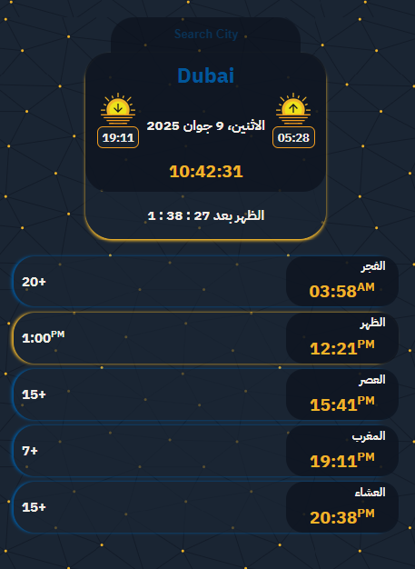

# 🕌 Prayer Times App 

> A beautiful, responsive Islamic prayer times application with real-time updates and countdowns, built with React and Material UI.

---

## 📷 Screenshots

 
---

## 🧩 Description

An elegant prayer times application that helps Muslims track daily prayer times for any location worldwide. Features include:

- Real-time countdown to next prayer
- Sunrise and sunset times
- Arabic date display
- Responsive design for all devices
- Beautiful Material UI interface with golden accents

---

## 🔧 Tech Stack

| Tech              | Usage                          |
|-------------------|--------------------------------|
| **React + Vite**         | Frontend framework             |
| **Material UI**   | UI components and styling      |
| **Moment.js**     | Date/time calculations         |
| **Axios**         | API requests                   |
| **Aladhan API**   | Prayer times data              |

---

## 🌟 Features

- 🕌 Accurate prayer times for any city worldwide
- ⏳ Real-time countdown to next prayer
- ☀️ Sunrise and sunset times with visual icons
- 📅 Current Hijri/Islamic date in Arabic
- 🔍 City search functionality
- 📱 Fully responsive design (mobile/tablet/desktop)
- 🎨 Beautiful golden-themed UI with subtle animations
- 🌙 Automatic day/night mode detection

---

## 🚀 How to Run Locally

### 1. Clone the project

```bash
git clone https://github.com/abdallahsekrafi/PrayersTime.git
cd PrayersTime
```

### 2. Install dependencies

```bash
npm install
```

### 3. Start the development server

```bash
npm run dev
nmp run mob
```

---

## 🛠 API Usage

The app uses the free [Aladhan Prayer Times API](https://aladhan.com/prayer-times-api):

```javascript
axios.get(`https://api.aladhan.com/v1/timingsByCity?city=${city}&country=`)
```

---

## 🎨 Design & UX

- 🧭 Clean, minimalist interface focused on prayer times
- 🖌️ Golden accents for important elements
- 📱 Card-based layout that adapts to screen size
- 🎯 Current prayer highlighted with special styling
- ☪️ Islamic-themed design elements

---

## 📦 Main Dependencies

```json
"dependencies": {
  "@mui/material": "^5.0.0",
  "axios": "^1.0.0",
  "moment": "^2.29.0",
  "react": "^18.0.0"
}
```

---

## 🧰 Available Scripts

```bash
npm run dev
npm run mob 
```

---

## 💼 Technologies Used

<div align="left">
  
  
  
  
  
  
  
  
  
</div>

---

## 🙏 Thanks for the two references

- **MAWAQIT**: [mawaqit.net](https://mawaqit.net/)
- **TARMEEZ**: [tarmeez](https://www.youtube.com/@tarmeez)
---

## 📬 Contact

- **LinkedIn**: [Abdallah Sekrafi](https://www.linkedin.com/in/abdallah-sekrafi-47232889/)
- **Facebook**: [fb.com/abdallah.sek](https://www.facebook.com/abdallah.sek/)
- **GitHub**: [github.com/abdallahsekrafi](https://github.com/abdallahsekrafi)

---
## © Sekrafi Abdallah @ 2025

This project is licensed under the MIT License.
